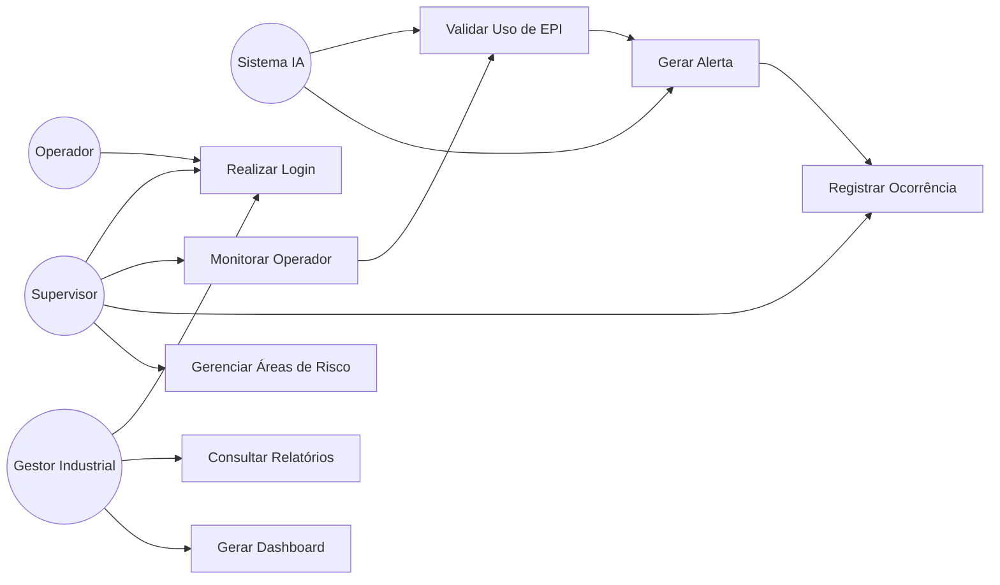

```mermaid
flowchart LR

Operador((Operador))
Supervisor((Supervisor))
Gestor((Gestor Industrial))
IA((Sistema IA))

UC1[Realizar Login]
UC2[Monitorar Operador]
UC3[Validar Uso de EPI]
UC4[Gerar Alerta]
UC5[Registrar Ocorrência]
UC6[Consultar Relatórios]
UC7[Gerar Dashboard]
UC8[Gerenciar Áreas de Risco]

Operador --> UC1
Supervisor --> UC1
Gestor --> UC1

Supervisor --> UC2
IA --> UC3
IA --> UC4
Supervisor --> UC5
Gestor --> UC6
Gestor --> UC7
Supervisor --> UC8

UC2 --> UC3
UC3 --> UC4
UC4 --> UC5
```
