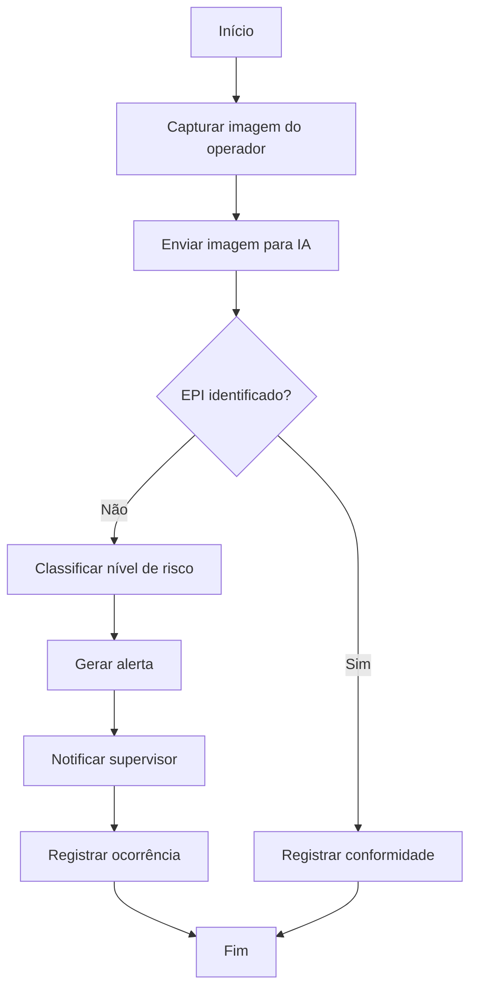

```mermaid
flowchart TD

A[Início] --> B[Capturar imagem do operador]
B --> C[Enviar imagem para IA]
C --> D{EPI identificado?}

D -->|Sim| E[Registrar conformidade]
D -->|Não| F[Classificar nível de risco]

F --> G[Gerar alerta]
G --> H[Notificar supervisor]
H --> I[Registrar ocorrência]
I --> J[Fim]

E --> J
```
