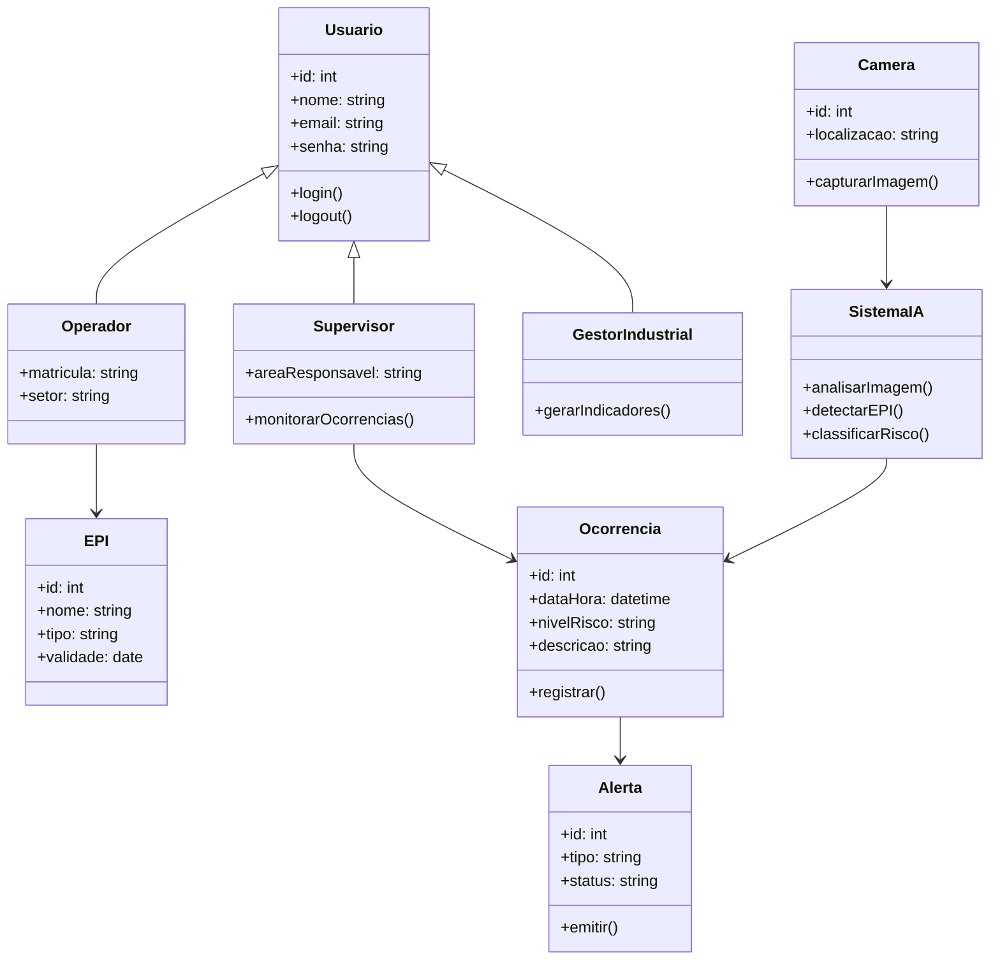

```mermaid
classDiagram

class Usuario {
+id: int
+nome: string
+email: string
+senha: string
+login()
+logout()
}

class Operador {
+matricula: string
+setor: string
}

class Supervisor {
+areaResponsavel: string
+monitorarOcorrencias()
}

class GestorIndustrial {
+gerarIndicadores()
}

class EPI {
+id: int
+nome: string
+tipo: string
+validade: date
}

class Ocorrencia {
+id: int
+dataHora: datetime
+nivelRisco: string
+descricao: string
+registrar()
}

class Alerta {
+id: int
+tipo: string
+status: string
+emitir()
}

class Camera {
+id: int
+localizacao: string
+capturarImagem()
}

class SistemaIA {
+analisarImagem()
+detectarEPI()
+classificarRisco()
}

Usuario <|-- Operador
Usuario <|-- Supervisor
Usuario <|-- GestorIndustrial

Operador --> EPI
Supervisor --> Ocorrencia
Ocorrencia --> Alerta
Camera --> SistemaIA
SistemaIA --> Ocorrencia
```
